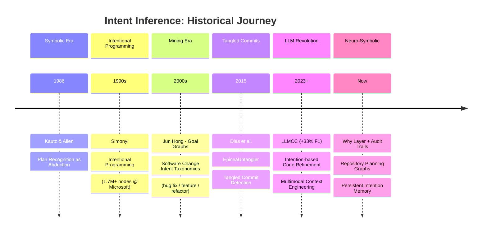
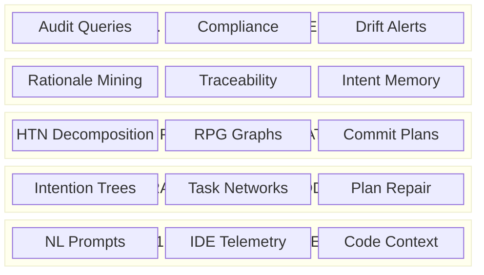
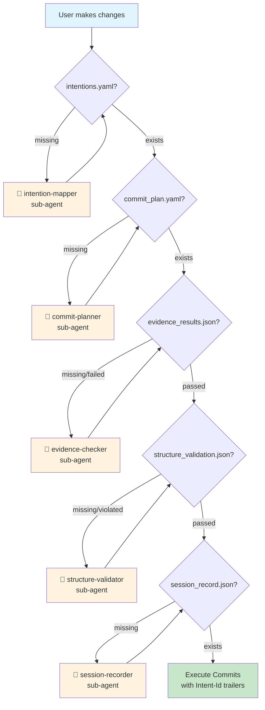
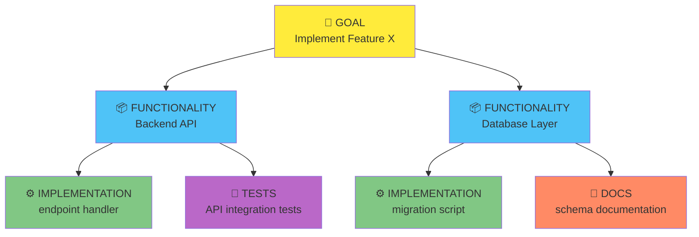
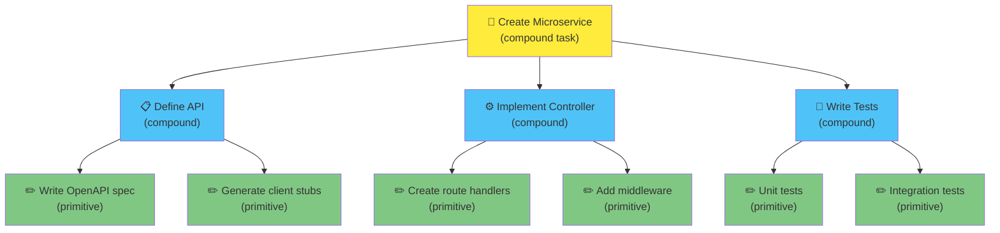
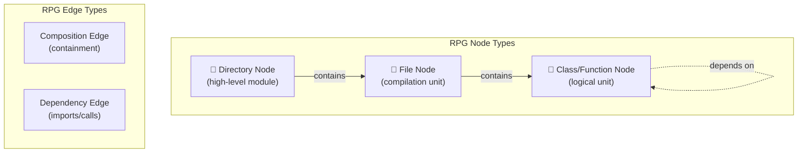

# Visual Reference Guide: Intent Inference History & Architecture

A diagram-heavy companion to [learning-01-historical-journey.md](learning-01-historical-journey.md). **Minimal prose—maximum visualization.**

---

## 1. Historical Timeline



---

## 2. The Modern Intent Stack



---

## 3. Planning Formalism Comparison

| Feature | Chain-of-Thought (CoT) | Hierarchical Task Network (HTN) | Repository Planning Graph (RPG) |
|---------|------------------------|----------------------------------|----------------------------------|
| **Structure** | Linear text sequence | Tree of Tasks + Methods | DAG of code units |
| **State Tracking** | Implicit (in history) | Explicit (tree state, preconditions) | Explicit (node completion) |
| **Dependency Mgmt** | Weak (hallucinated refs) | Strong (preconditions) | Strong (topological sort) |
| **Scalability** | Low (< 5k LOC) | Medium (task complexity limits) | High (> 30k LOC) |
| **Recovery** | Restart often required | Backtracking / plan repair | Granular node re-generation |
| **Best For** | Simple tasks, explanations | Multi-step procedures | Repository-scale generation |

---

## 4. Research-to-Implementation Mapping

| Research Concept | This Project's Implementation | Artifact |
|-----------------|------------------------------|----------|
| Intention tree / hierarchical goals | `Intention` model with `IntentionKind` enum | `intentions.yaml` |
| Commit intent attribution | Commit entries with `intent_id` + trailers | `commit_plan.yaml` |
| Rationale capture | `rationale` field + `supporting_docs` | Intention nodes |
| Evidence of intent holding | `evidence_tests` selectors | `evidence_results.json` |
| Structural alignment / drift | `code_home` boundary checking | `structure_validation.json` |
| Session trace / audit | Normalized session records | `session_record.json` |
| Plan repair | Stop hook blocking + sub-agent spawning | `stop_hook.py` |

---

## 5. Project Pipeline Flowchart



---

## 6. Intent Hierarchy Visualization



**IntentionKind enum values:**
- `goal` — Top-level objective
- `functionality` — Cohesive capability (has `code_home`)
- `implementation` — Code changes
- `tests` — Test code
- `docs` — Documentation
- `observability` — Logging/metrics

---

## 7. HTN Decomposition Example



**HTN concepts:**
- **Compound task** — Decomposes into subtasks via *methods*
- **Primitive task** — Directly executable action
- **Method** — Recipe for decomposition (preconditions + subtasks)

---

## 8. Repository Planning Graph (RPG) Structure



**RPG enables:**
- Topological generation (dependencies first)
- Modular context loading (only relevant subgraph)
- Scalability to 36k+ LOC (vs ~3.5k for flat context)

---

## 9. Telemetry → Cognitive State → Agent Action

| Telemetry Signal | Cognitive State | Developer Intent | Agent Action |
|-----------------|-----------------|------------------|--------------|
| Rapid typing, linear cursor, minimal backspace | **Flow / Execution** | Implementing known logic | **Suppress** interruptions |
| Long pauses, frequent scrolling, hovering | **Uncertainty / Recall** | API discovery, context recall | **Trigger** docs/explanation |
| Source↔Test↔Terminal oscillation | **Validation / Debug** | TDD cycle, fixing regressions | **Trigger** test helper |
| High deletions, block selections, renames | **Restructuring / Refactor** | Removing tech debt | **Suppress** generation, suggest refactors |

---

## 10. Key Papers Reference

| Year | Authors/Title | Contribution |
|------|---------------|--------------|
| 1986 | Kautz & Allen | Plan recognition as abduction |
| 1990s | Simonyi (Microsoft) | Intentional Programming |
| 2000s | Jun Hong | Goal graphs for SW engineering |
| 2015 | Dias et al. | EpiceaUntangler (tangled commits) |
| 2021 | Al-Safwan & Servant | Rationale decomposition (15 fields) |
| 2023 | LLMCC | +33% F1 on commit intent classification |
| 2024 | ZeroRepo/RPG | 36k+ LOC coherent generation |
| 2024 | DRMiner | LLM-based rationale extraction |
| 2024 | Atomizer | LLM-driven commit untangling |

---

## 11. Glossary Quick-Reference

| Term | Definition |
|------|------------|
| **Intent detection** | Infer what the developer wants (from NL + context) |
| **Plan recognition** | Infer the plan structure explaining observed actions |
| **HTN** | Hierarchical Task Network — goal decomposition formalism |
| **Intention tree** | Persistent hierarchical representation of goals + execution state |
| **RPG** | Repository Planning Graph — DAG of code units for scalable generation |
| **Why Layer** | Auditable rationale linking code → intentions → evidence → decisions |
| **Drift detection** | Detect divergence between intended design and actual implementation |
| **Tangled commit** | Single commit bundling multiple unrelated changes |
| **Code home** | Declared path prefixes where a functionality's code must reside |
| **Evidence test** | Test selector proving an intention is satisfied |

---

## 12. Artifact Directory Structure

```
.intent_audit/
└── <session_id>/
    └── <diff_hash>/
        ├── intentions.yaml          # Intention tree
        ├── commit_plan.yaml         # File→intent mapping
        ├── evidence_results.json    # Test run results
        ├── structure_validation.json # code_home checks
        └── session_record.json      # Audit trail
```

---

## See Also

- [learning-01-historical-journey.md](learning-01-historical-journey.md) — Prose-based historical narrative
- [02-fundamental-gemini-intent-hierarchy.md](02-fundamental-gemini-intent-hierarchy.md) — Full Gemini research synthesis
- [02-fundamental-chatgpt-intent-inference.pdf](02-fundamental-chatgpt-intent-inference.pdf) — ChatGPT research lineage
- [synthesis-02-applicable-patterns.md](synthesis-02-applicable-patterns.md) — Patterns mapped to architecture
